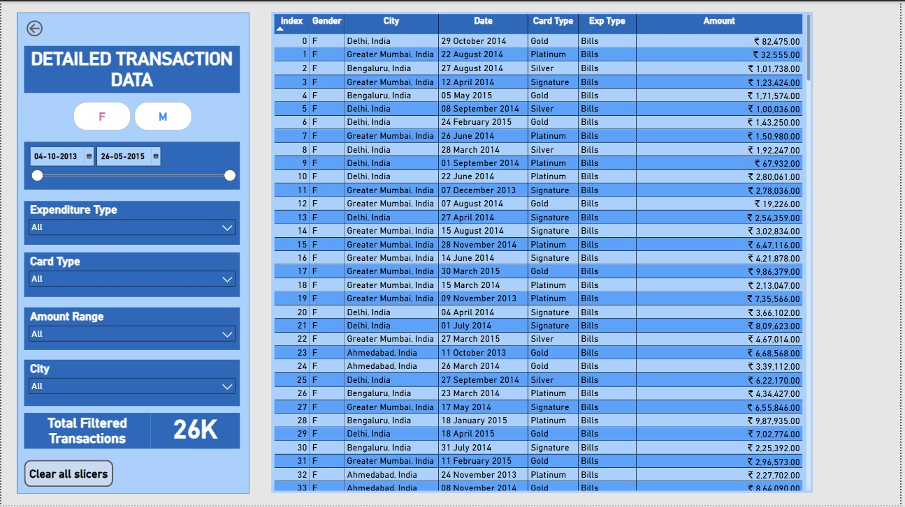

# 💳 Credit Card Spending Behavior Dashboard

This Power BI dashboard explores how consumers across India used credit cards between 2013 and 2015. It highlights trends in spending categories, card types, transaction amounts, and city-level behavior — all packaged into an interactive, visual report.

---

## 📊 Key Highlights

- ₹4.07 billion in total transaction amount  
- 26,000 total transactions  
- Most used card type: **Silver**  
- Most frequent expense: **Food**  
- Top cities by spending: **Greater Mumbai, Bengaluru, Delhi**  
- Majority of transactions fall in the ₹150K–₹300K range  

---

## 🛠️ Tools Used

- **Power BI**: Data import, Power Query, DAX, Visualizations
- Donut chart, KPI cards, treemaps, stacked bars
- Slicers for date, gender, and aggregation type (Sum/Avg/Median)

---

## 🖼️ Dashboard Previews

**Page 1 – Summary View**  

**Page 2 – Detailed Table View**  

---

## 📁 Included Files

- `credit_card_spending_behavior_dashboard.pbix` – Power BI file  
- `dashboard_summary.jpg` & `detailed_table_view.jpg` – Dashboard snapshots  

---

## 🔗 Data Source

This project uses publicly available data from Kaggle, shared for educational purposes.

> Dataset: *Credit Card Spending Habits in India*  
> Source: [Kaggle](https://www.kaggle.com/datasets/thedevastator/analyzing-credit-card-spending-habits-in-india)

---

## 📌 About This Project

Built as a personal project to practice real-world Power BI skills like data transformation, storytelling with visuals, and interactive filtering. Ideal for exploring consumer behavior patterns and dashboard building in a business context.
